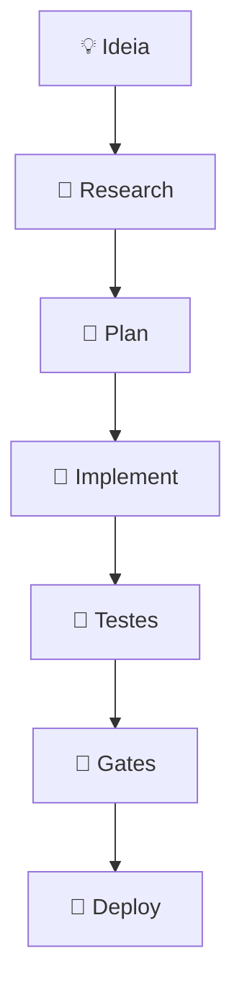

# 🏭 Factory

> **Framework publico para Context Engineering, Spec-driven Delivery e governanca de entrega de software.**

Factory existe para resolver um problema simples e ignorado:

🚨 **IA nao falha por codigo.**  
**IA falha por CONTEXTO mal definido.**

---

## 🎯 O que e a Factory

Factory e o **sistema operacional do desenvolvimento de software**.

Ela nao gera codigo sozinha.  
Ela define **como pesquisar, decidir, planejar, validar e automatizar** a construcao de software — **antes**, **durante** e **depois** da implementacao.

---

## 🧭 Workflow canonico: RPI (Research → Plan → Implement)

### Fluxo (Mermaid)



### Fluxo (fallback)

```
IDEIA
  ↓
RESEARCH (evidencias + gaps)
  ↓
PLAN (escopo + passos + testes)
  ↓
IMPLEMENT (codigo + docs)
  ↓
TESTES
  ↓
GATES
  ↓
DEPLOY
```

---

## 🤖 Execucao e bots

- **Executor de IA** (IDE assistant / LLM executor) edita arquivos.
- **Bots Python** executam **apenas via CLI local** (ou CI configurado).
- Nada executa sem contexto fechado; gaps devem ser registrados.

👉 **Como executar bots:** veja `factory-workflow/docs/quickstart.md`.

---

## 🧠 Contexto e governanca

- **Contexto e fonte de verdade:** `factory-workflow/context/*`.
- **Reuso antes de criar:** politica MCP em `factory-workflow/context/tooling/mcp-policy.md`.
- **Seguranca e gates:** `factory-workflow/cicd/*`.
- **Governanca e auditoria:** `factory-workflow/governance/*`.

---

## 📁 Estrutura essencial

- `factory-workflow/docs/` → onboarding, workflow, templates
- `factory-workflow/context/` → core, quality, tooling, UI, codex
- `factory-workflow/bots/` → contratos de bots (Markdown)
- `factory-workflow/bots/runtime/` → runtime local (CLI)
- `factory-workflow/libs/mcp/` → servers e registries MCP
- `factory-workflow/cicd/` → gates, checklist, deploy

---

## 🚀 Por onde comecar

1) `factory-workflow/docs/quickstart.md`  
2) `factory-workflow/docs/workflow.md`  
3) `factory-workflow/docs/templates/README.md`  
4) `factory-workflow/docs/examples/README.md`

---

## 🔐 Regras inegociaveis

- Contexto fechado antes de executar.
- Plan aprovado antes de implementar.
- Evidencias e links em Research/Plan.
- Producao exige aprovacao humana.

---

## 🔗 Referencias rapidas

- Workflow RPI: `factory-workflow/docs/workflow.md`
- Politica MCP: `factory-workflow/context/tooling/mcp-policy.md`
- Runtime local (CLI): `factory-workflow/context/tooling/runtime.md`
- Quickstart: `factory-workflow/docs/quickstart.md`
