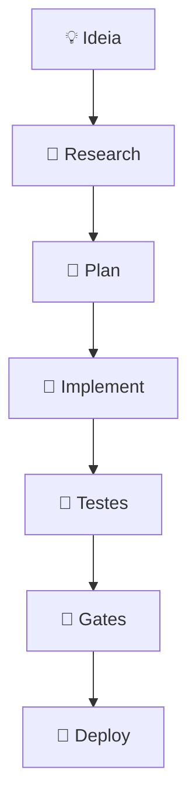

# 🏭 Factory (Context Engineering + Spec-driven Delivery)

> Framework (por enquanto **interno**) para **Context Engineering**, **Spec-driven Delivery** e **governança de entrega de software**.

A Factory existe para resolver um problema simples e ignorado:

- IA raramente falha por "não saber codar".
- IA falha por **contexto mal definido**, **decisões não registradas** e **planos fracos**.

A proposta aqui é transformar desenvolvimento com IA (e sem IA) em um processo **auditável**, **repetível** e **seguro**.

---

## 🎯 O que é a Factory

A Factory é um **sistema operacional de entrega**.

Ela não "gera código magicamente". Ela define:
- como **pesquisar** (com evidências)
- como **decidir** (com registro)
- como **planejar** (com escopo, passos e testes)
- como **implementar** (com proteções)
- como **validar** (com QA e gates)
- como **publicar** (com controle humano)

---

## 🧭 Workflow canônico: RPI (Research → Plan → Implement)

```mermaid
flowchart TD
    A[💡 Ideia] --> B[🔎 Research]
    B --> C[🧭 Plan]
    C --> D[🧱 Implement]
    D --> E[🧪 Testes]
    E --> F[🚦 Gates]
    F --> G[🚀 Deploy]
```

Regras do jogo:
- **Sem Research** você vira refém de suposições.
- **Sem Plan aprovado** você vira refém de retrabalho.
- **Sem QA/gates** você vira refém de sorte.

---

## 🤖 Execução (IA + bots)

- **Executor de IA** (IDE assistant / LLM executor) **edita arquivos**.
- **Bots em Python** executam **apenas via CLI local** (ou CI configurado).
- Se existir gap, o sistema **registra e para**.

👉 Como executar bots: `factory-workflow/docs/quickstart.md`

---

## 🧠 Contexto e governança (fontes de verdade)

- **Ordem de leitura do contexto (obrigatória):** `factory-workflow/context/INDEX.md`
- **Políticas (não-opcionais):** `factory-workflow/policies/policy-engine.md`
- **CI/CD e gates:** `factory-workflow/cicd/*`
- **Governança e auditoria:** `factory-workflow/governance/*`

---

## 📁 Estrutura essencial

- `factory-workflow/docs/` → onboarding, workflow, templates
- `factory-workflow/context/` → fontes de verdade (core, quality, tooling, UI, codex)
- `factory-workflow/bots/` → contratos de bots (Markdown)
- `factory-workflow/bots/runtime/` → runtime local (CLI)
- `factory-workflow/cicd/` → gates, checklist, deploy

---

## 🚀 Por onde começar

1) Copie `Docs.example/` para a raiz do seu projeto e renomeie para `docs/` (preencha os PRDs)
2) Rode `context-sync` para popular `factory-workflow/context/*`
3) Use o workflow RPI (Research → Plan → Implement)

Referências:
- Quickstart: `factory-workflow/docs/quickstart.md`
- Workflow RPI: `factory-workflow/docs/workflow.md`
- Templates internos: `factory-workflow/docs/templates/README.md`
- Exemplos: `factory-workflow/docs/examples/README.md`

---

## 🔐 Regras inegociáveis

- **Contexto fechado** antes de executar.
- **Plan aprovado** antes de implementar.
- **Evidências e links** em Research/Plan.
- **Produção exige aprovação humana**.

---

## Últimas atualizações

- 2026-01-25 - docs: tutorial de uso, templates, checklists e diagramas
- 2026-01-25 - CI: workflow de publish de pacote Python (commit `9414abf`)
- 2026-01-19 - feat(factory): enable qa-e2e-browser-audit runtime bot (commit `d6c0c0a`)
- 2026-01-19 - feat(factory): add chrome devtools mcp + browser audit qa bot (commit `97c1bd2`)
