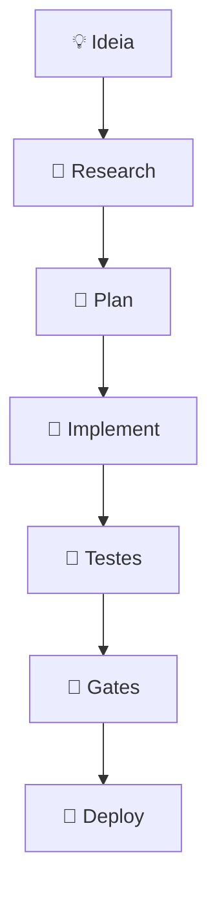

# SecureContextFactory

> **Framework Python-first de entrega guiada por contexto e especificacao, com governanca inegociavel.**
> Compatível com qualquer IDE/executor: **Cursor, Codex, Claude Code, Antigravity, Windsurf**, etc.

SecureContextFactory transforma desenvolvimento com IA em um processo industrial: **auditavel, repetivel e seguro**.
O core e a governanca (gates, policies, gaps forcados, audit trail e aprovacao humana para risco).

Direcao de fusao (camadas opcionais):
- UX/arquitetura inspiradas no SynkraAI/aios-core (wizard, squads, pipeline ADE-like) reimplementadas em Python.
- Orquestracao stateful (LangGraph) como camada opcional.
- Squads/crews colaborativos (CrewAI) como camada opcional.

---

## A Ciencia da Ineficiencia: por que tanto tempo e perdido?

Nao e magica, e processo. SecureContextFactory ataca gargalos invisiveis do desenvolvimento com IA:

| Problema Real | % Tempo Perdido | Como a SecureContextFactory resolve |
| :--- | :--- | :--- |
| **Contexto perdido entre sessões** | ~20% | **Persistência em `context/` e `gaps.md`.** A IA nunca esquece. |
| **Retrabalho por má especificação** | ~30% | **PRDs e Plans aprovados.** Nada é codado sem spec. |
| **Inconsistência (Dev/IA faz do jeito dele)** | ~15% | **Metodologia RPI.** Padrão industrial de 1 a 10 devs. |
| **"O que faltou mesmo?" (Gaps)** | ~10% | **Gap Tracking com Sugestão.** O sistema não trava, ele propõe. |
| **Onboarding de novo dev** | ~15% | **Documentação Viva.** O código é a documentação. |

> Estimativa pratica: SecureContextFactory pode reduzir desperdicio em projetos complexos ao eliminar "amnesia" e retrabalho via RPI + contexto persistente + gates.

## Para quem e isso?

- **Dev Solo:** Que quer construir sistemas complexos sem se perder no meio do caminho.
- **Startups (1-10 devs):** Que precisam de onboarding rápido e garantia de qualidade sem burocracia.
- **Tech Leads:** Que querem garantir governança e auditoria sobre o código gerado por IA.

---

## Arquitetura: "Verdade vs Fabricacao"



```mermaid
flowchart TD
    A[💡 Ideia] --> B[🔎 Research]
    B --> C[🧭 Plan]
    C --> D[🧱 Implement]
    D --> E[🧪 Testes]
    E --> F[🚦 Gates]
    F --> G[🚀 Deploy]
```

**Regras do jogo:**
- **Sem Research:** Você vira refém de suposições.
- **Sem Plan aprovado:** Você vira refém de retrabalho.
- **Sem QA/gates:** Você vira refém de sorte.

---

## Arquitetura de pastas

SecureContextFactory organiza o projeto em mundos distintos para evitar confusao:

| Pasta | Propósito | Quem Escreve | Quem Lê |
|-------|-----------|--------------|---------|
| `docs.prd/` | **Fonte da Verdade.** PRDs em linguagem natural (PT-BR/EN). | Você / GPT Architect | Bot Planner |
| `library/` | **Biblioteca de Consulta.** Skills (600+), Tooling, MCPs. | Sistema / Importação | Todos os Bots |
| `factory-workflow/` | **Motor (governanca + runtime).** Contexto, Bots, CI/CD, Governance. | Bots / Orquestrador | Bots / Sistema |
| `factory-workflow/docs.fabrication/` | **Specs Técnicas.** Roadmap, Milestones, Dependencies. | Bot Planner | Bots Dev/Architect |

### Detalhamento:
- `docs.prd/` → Onde você coloca seus documentos de requisitos (PDF, MD, Texto).
- `library/skills/` → 600+ skills especializadas (SEO, React, Security, etc.). Consulte o `INDEX.md`.
- `library/tooling/` → Ferramentas e MCPs configurados.
- `factory-workflow/bots/` → Contratos de cada Bot (Markdown).
- `factory-workflow/bots/runtime/` → Runtime CLI para execução local.
- `factory-workflow/context/` → Fontes de verdade do projeto (core, quality, UI, codex).
- `factory-workflow/cicd/` → Gates, checklists e deploy configs.
- `factory-workflow/governance/` → Auditoria e governança.
- `factory-workflow/policies/` → Políticas obrigatórias.

---

## Modelo de execucao (hibrido)

SecureContextFactory foi projetada para funcionar com **qualquer executor de IA**:

| Executor | Tipo | Descrição |
|----------|------|-----------|
| **Cursor** | IDE | Assistente integrado ao VSCode. |
| **Claude Code** | CLI | Agente via terminal. |
| **Codex (OpenAI)** | API/CLI | Executor de código. |
| **Antigravity** | IDE | Assistente integrado. |
| **Windsurf** | IDE | Assistente integrado. |
| **Bots Python (CLI)** | Runtime | Bots internos da SecureContextFactory (`factory-workflow/bots/runtime/`). |

**Regra de Ouro:**
- O **Executor de IA** (IDE ou CLI) **edita arquivos**.
- Os **Bots Python** executam **via CLI local** (ou CI configurado).
- Se existir gap de informação, o sistema **registra em `gaps.md` e para**.

---

## Fontes de verdade e governanca

- **Ordem de leitura do contexto (obrigatória):** `factory-workflow/context/INDEX.md`
- **Políticas (não-opcionais):** `factory-workflow/policies/policy-engine.md`
- **CI/CD e gates:** `factory-workflow/cicd/*`
- **Governança e auditoria:** `factory-workflow/governance/*`

---

## Regras inegociaveis

1. **Contexto fechado** antes de executar.
2. **Plan aprovado** antes de implementar.
3. **Evidências e links** obrigatórios em Research/Plan.
4. **Produção exige aprovação humana**.

---

## Configuracao inicial (MCPs e ferramentas)

**IMPORTANTE:** Antes de iniciar a fabricação, o sistema precisa de MCPs configurados. Quando você enviar o primeiro prompt, a IA irá auditar a configuração e trazer um **Gap de Configuração** se algo estiver faltando.

### Passo 1: Copiar o arquivo de configuração
```bash
cp factory-workflow/config/mcp.example.toml factory-workflow/config/mcp.toml
```

### Passo 2: Configurar as variáveis de ambiente
Crie um arquivo `.env` na raiz do projeto (ou configure no seu sistema):

```bash
# MCPs Gratuitos (recomendados)
CONTEXT7_TOKEN=seu_token_aqui          # https://context7.com (docs/API lookup)

# MCPs Opcionais (ative conforme necessidade)
GITHUB_TOKEN=seu_token_aqui            # https://github.com/settings/tokens
HUGGINGFACE_TOKEN=seu_token_aqui       # https://huggingface.co/settings/tokens
STACKOVERFLOW_KEY=sua_key_aqui         # https://stackapps.com/apps/oauth/register

# MCPs de Automação (configuração local)
PLAYWRIGHT_ENDPOINT=http://localhost:3000
CHROME_DEVTOOLS_ENDPOINT=http://localhost:9222
```

### Passo 3: Ativar MCPs no arquivo `mcp.toml`
Edite `factory-workflow/config/mcp.toml` e mude `enabled = true` para os MCPs que você configurou.

### MCPs Disponíveis

| MCP | Propósito | Requer Chave? |
|-----|-----------|---------------|
| **Context7** | Consulta de docs oficiais e APIs | ✅ Gratuito |
| **GitHub** | Issues, PRs, operações de repo | ✅ Token gratuito |
| **HuggingFace** | Modelos de IA, datasets | ✅ Gratuito |
| **Playwright** | Testes E2E automatizados | ❌ Local |
| **Chrome DevTools** | Auditoria de performance/UX | ❌ Local |
| **StackOverflow** | Consulta auxiliar | ✅ Opcional |
| **Shadcn Registry** | Componentes UI | ❌ Público |
| **Security Audit** | Auditoria de dependências | ✅ Opcional |

---

## 🎬 Primeiro Prompt (Copie e Cole)

Use este prompt para iniciar qualquer projeto novo:

```
Leia e entenda a documentação do SecureContextFactory (README.md e factory-workflow/context/INDEX.md).
Depois, leia todos os arquivos em docs.prd/.
Antes de iniciar a fabricação, audite se os MCPs estão configurados corretamente.
Se houver gaps de configuração, traga-os com sugestões de solução.
Após a configuração estar OK, inicie a fabricação seguindo a metodologia RPI.
```

---

## Como usar (one-command)

SecureContextFactory foi projetada para **zero microgerenciamento**. Você só precisa dizer uma frase:

> **"Leia e entenda a documentação do SecureContextFactory, depois leia os arquivos em `docs.prd/` e inicie a fabricação."**

**O que acontece automaticamente:**
1. O sistema lê a metodologia (`README.md`, `factory-workflow/context/INDEX.md`).
2. Analisa seus PRDs em `docs.prd/`.
3. Consulta as skills necessárias em `library/skills/INDEX.md`.
4. Inicia o workflow RPI (Research → Plan → Implement).
5. Se encontrar dúvidas, registra um **Gap com Sugestão de Solução**.

### Novo Projeto (Passo a Passo)
1. Clone o repositório SecureContextFactory para a raiz do seu projeto.
2. Coloque seus PRDs em `docs.prd/`.
3. Abra sua IDE (Cursor, Claude, Codex, Antigravity, etc.).
4. Diga: *"Leia a documentação do SecureContextFactory e os PRDs, e inicie a fabricação."*
5. Pronto. O sistema cuida do resto.

---

## Instalar a skill no Codex (global)

Se voce quer que a skill do SecureContextFactory funcione em qualquer projeto, instale-a em `~/.codex/skills/`.

Passo a passo:
1. Crie a pasta de skills: `mkdir -p ~/.codex/skills`
2. Copie a skill do SecureContextFactory: `cp -R library/skills/factory-dev-workflow ~/.codex/skills/`
3. Reinicie o Codex (ou sua IDE) para recarregar as skills.

Isso garante que a skill seja carregada automaticamente em qualquer repo, sem precisar copiar o framework inteiro.

---

## 🧠 PRD Direto no Chat (Fluxo Esperado)

Opção recomendada: **PRD em arquivo** (`docs.prd/`).

Se o usuário colar o PRD no chat (fallback), o agente deve:
1. Criar/atualizar `docs.prd/prd.md`, `docs.prd/tech.md`, `docs.prd/ui-ux.md` com o conteúdo.
2. Rodar `context-sync` para distribuir o contexto.
3. Gerar `plan.md` (DRAFT) com o RPI.
4. Solicitar aprovação do plan.
5. Executar implementação + QA após aprovação.

**Objetivo do framework:** entregar software funcional e pronto para produção, com evidências de QA e gates satisfeitos. Se faltar informação, abrir GAP e parar.

---

## ✍️ Prompt Padrão (para o usuário)

Cole este prompt no chat para iniciar um projeto:

```
Use SecureContextFactory.
Meu PRD está em `docs.prd/`.
Leia README.md e factory-workflow/context/INDEX.md.
Rode context-sync e gere o plan.md (DRAFT).
Peça minha aprovação antes de implementar.
```

---

## CLI (securecontextfactory)

Instalacao (repo):
```bash
pip install -e .
```

Instalacao com integracoes opcionais (LangGraph + CrewAI):
```bash
pip install -e ".[langgraph,crewai]"
```

Bootstrap + MCP wizard (opcional):
```bash
securecontextfactory init
securecontextfactory install --kickconfig
```

Diagnostico:
```bash
securecontextfactory doctor
```

Hooks no workspace (VSCode/Cursor/AGENTS):
```bash
securecontextfactory hook install all
```

Autopilot (wrappers do runtime):
```bash
securecontextfactory autopilot-start --feature "current"
securecontextfactory autopilot-build --feature "current" --project "apps/<projeto>" --with-e2e
```

Squads (CrewAI opcional):
```bash
securecontextfactory squad list
securecontextfactory run-squad default --feature "current" --task "..."
```

Auditoria rapida:
```bash
securecontextfactory audit --feature "current"
```

---

## Comandos essenciais (runtime)

Context-sync:
```bash
cp -R docs.prd docs
python factory-workflow/bots/runtime/cli.py run context-sync \
  --task "Distribuir PRDs de ./docs para factory-workflow/context" \
  --workspace "."
```

**Importante:** O contexto sempre fica **dentro do projeto** em `factory-workflow/context/*`.  
A skill pode ser global, mas o contexto **não é global**.

Autopilot:
```bash
python factory-workflow/bots/runtime/cli.py autopilot-start \
  --workspace "." \
  --feature "current"
```

```bash
python factory-workflow/bots/runtime/cli.py autopilot-build \
  --workspace "." \
  --feature "current" \
  --project "/apps/<projeto>" \
  --with-e2e
```

---

## 🧭 Mini Guia (PRD → Produção)

1. Cole o PRD completo no chat (ou coloque em `docs.prd/`).
2. Diga: “Gere `docs.prd/prd.md`, `docs.prd/tech.md`, `docs.prd/ui-ux.md` e rode `context-sync`.”
3. Diga: “Gere o `plan.md` (DRAFT) seguindo RPI e peça minha aprovação.”
4. Após aprovação, diga: “Execute o `autopilot-build` com QA.”
5. Valide evidências em `factory-workflow/tests/reports/**` e finalize.

---

## 🛑 Tratamento de Gaps

Quando o sistema encontra uma dúvida bloqueante, ele **para e te consulta**.

**Formato do Gap:**
```markdown
### GAP-XXX
- Descrição: [O que está faltando ou ambíguo]
- Impacto: BLOQUEIA
- **Sugestão de Solução:** [Proposta do agente para resolver]
```

**Como responder:**
- ✅ *"Aplique a sugestão do GAP-XXX."* → O agente continua.
- 💬 *"Vamos discutir, prefiro usar Y em vez de X."* → O agente ajusta e propõe novamente.

---

## 📚 Referências Internas

- Quickstart detalhado: `factory-workflow/docs.fabrication/quickstart.md`
- Workflow RPI: `factory-workflow/docs.fabrication/workflow.md`
- Templates: `factory-workflow/docs.fabrication/templates/README.md`
- Exemplos: `factory-workflow/docs.fabrication/examples/README.md`

---

## 📖 Tutorial: Caso de Uso Real

### Cenário: Criar um SaaS de Agendamento

**Passo 1: Levantamento de Requisitos (Factory Architect GPT)**
1. Acesse o [Factory Architect GPT](https://chatgpt.com/g/g-6967f8e0ff388191a1aad70464bbb4a8-factory-architect).
2. Converse: *"Quero criar um SaaS de agendamento para barbearias."*
3. O GPT te entrevista e gera um PRD completo.
4. **Ação:** Salve o arquivo como `docs.prd/agendamento-barbearia.md`.

**Passo 2: Planejamento (Planner Bot)**
1. Abra sua IDE (Cursor, Claude, Codex, etc.).
2. Comande: *"Planner, leia os PRDs em `docs.prd/` e gere o plano de execução."*
3. O Planner:
    - Lê o PRD.
    - Consulta `library/skills/INDEX.md` e seleciona skills relevantes (ex: `nextjs-app-router`, `stripe-integration`).
    - Gera specs em `factory-workflow/docs.fabrication/`.

**Passo 3: Implementação (Dev Bot)**
1. Comande: *"Dev, execute a Fase 1 do plano."*
2. O Dev:
    - Lê as specs de `docs.fabrication`.
    - Consulta as skills obrigatórias.
    - Escreve código seguindo as regras e testes.

---

## 📜 Changelog (Atualizações)

| Data | Descrição | Commit |
|------|-----------|--------|
| 2026-02-02 | refactor: Reestruturação arquitetural (`docs.prd`, `library`, `docs.fabrication`) e integração de 600+ skills. | `996c75b` |
| 2026-01-25 | docs: Tutorial de uso, templates, checklists e diagramas. | - |
| 2026-01-25 | CI: Workflow de publish de pacote Python. | `9414abf` |
| 2026-01-19 | feat(factory): Enable qa-e2e-browser-audit runtime bot. | `d6c0c0a` |
| 2026-01-19 | feat(factory): Add Chrome DevTools MCP + browser audit QA bot. | `97c1bd2` |


---

## 📚 Créditos e Referências

Este projeto e inspirado por e referencia as seguintes fontes (metodologias, docs e ferramentas):

### Metodologias e Conceitos
| Conceito | Fonte | Link |
|----------|-------|------|
| Context Engineering | Anthropic / Tobi Lutke | [Shopify CEO on Context Engineering](https://x.com/tolobi/status/1935533386722549780) |
| Spec-driven Development | Geoffrey Litt | [Specifying Software with AI](https://www.geoffreylitt.com/2025/01/03/specifying-software-with-ai.html) |
| Agentic Coding | Anthropic | [Claude Code Best Practices](https://www.anthropic.com/engineering/claude-code-best-practices) |
| AGENTS.md Convention | OpenAI | [Codex AGENTS.md](https://openai.com/index/codex-agents-md/) |
| RPI Workflow | Interno | Adaptação de metodologias ágeis |

### Bibliotecas e Skills
| Recurso | Fonte | Link |
|---------|-------|------|
| Antigravity Skills | Google DeepMind (Antigravity) | [Antigravity Awesome Skills](https://github.com/anthropics/antigravity-awesome-skills) |
| Model Context Protocol (MCP) | Anthropic | [MCP Spec](https://modelcontextprotocol.io/) |
| Playwright | Microsoft | [Playwright Docs](https://playwright.dev/) |
| Chrome DevTools Protocol | Google | [CDP Docs](https://chromedevtools.github.io/devtools-protocol/) |

### Ferramentas e Integrações
| Ferramenta | Descrição | Link |
|------------|-----------|------|
| Context7 | MCP para docs oficiais | [Context7](https://context7.com/) |
| Shadcn/UI | Component registry | [Shadcn](https://ui.shadcn.com/) |
| HuggingFace | Modelos e datasets | [HuggingFace](https://huggingface.co/) |

---

## 🧾 Índice de Atualizações (2026-02-16)

- Adicionada a skill `factory-dev-workflow` com fluxo RPI, runtime/autopilot e skill-resolver.
- Instruções para instalar a skill globalmente em `~/.codex/skills/`.
- Fluxo recomendado para PRD em arquivo e fallback via chat.
- Comandos essenciais do runtime e mini guia PRD → produção.
- Prompt padrão enxuto para iniciar a fabricação.
- Skill registrada em `library/skills/INDEX.md`.

---

## 📄 Licença

Apache-2.0. Veja `LICENSE`.

Aviso: integracoes opcionais tem licencas proprias. Veja `THIRD_PARTY_NOTICES.md`.
