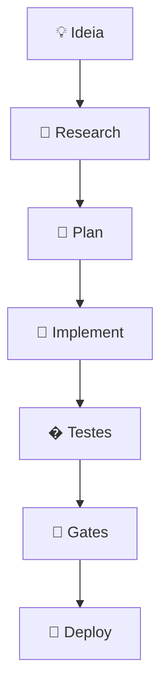

# 🏭 Factory (Context Engineering + Spec-driven Delivery)

> **Framework de Entrega Guiado por Contexto e Especificação.**
> Compatível com qualquer IDE: **Cursor, Codex, Claude Code, Antigravity, Windsurf**, etc.

A Factory existe para transformar o desenvolvimento de software com IA em um processo industrial: **Auditável, Repetível e Seguro.**

---

## 🛑 O Problema: Por que IA falha em projetos reais?

Se você já tentou criar software complexo com IA, conhece estas dores:

| A Dor (O Caos) | A Solução Factory (A Ordem) |
| :--- | :--- |
| **"Amnésia da IA"** <br> A IA esquece o que fez na sessão anterior ou perde o fio da meada. | **Contexto Persistente** <br> Memória estruturada em `factory-workflow/context` e `gaps.md`. O contexto nunca morre. |
| **Microgerenciamento** <br> Você gasta mais tempo explicando *o que fazer* do que codando. | **Spec-driven** <br> PRDs viram PLANOS aprovados antes de virarem CÓDIGO. Menos chat, mais entrega. |
| **"Funciona na minha máquina"** <br> Cada dev (ou IA) faz de um jeito diferente e quebra o padrão. | **Padronização RPI** <br> Todos seguem o mesmo fluxo: Research → Plan → Implement. Escalável de **1 a 10+ devs**. |
| **Alucinação** <br> A IA inventa libs que não existem ou soluções inseguras. | **Skills Curadas** <br> Biblioteca com 600+ skills validadas (`library/skills`) que a IA *deve* consultar. |

---

## 🎯 Para quem é isso?

- **Dev Solo:** Que quer construir sistemas complexos sem se perder no meio do caminho.
- **Startups (1-10 devs):** Que precisam de onboarding rápido e garantia de qualidade sem burocracia.
- **Tech Leads:** Que querem garantir governança e auditoria sobre o código gerado por IA.

---

## 🏗️ Nova Arquitetura: "Verdade vs Fabricação"



```mermaid
flowchart TD
    A[💡 Ideia] --> B[🔎 Research]
    B --> C[🧭 Plan]
    C --> D[🧱 Implement]
    D --> E[� Testes]
    E --> F[🚦 Gates]
    F --> G[🚀 Deploy]
```

**Regras do jogo:**
- **Sem Research:** Você vira refém de suposições.
- **Sem Plan aprovado:** Você vira refém de retrabalho.
- **Sem QA/gates:** Você vira refém de sorte.

---

## 🏗️ Arquitetura de Pastas

A Factory organiza o projeto em três "mundos" distintos para evitar confusão:

| Pasta | Propósito | Quem Escreve | Quem Lê |
|-------|-----------|--------------|---------|
| `docs.prd/` | **Fonte da Verdade.** PRDs em linguagem natural (PT-BR/EN). | Você / GPT Architect | Bot Planner |
| `library/` | **Biblioteca de Consulta.** Skills (600+), Tooling, MCPs. | Sistema / Importação | Todos os Bots |
| `factory-workflow/` | **Motor da Fábrica.** Contexto, Bots, CI/CD, Governance. | Bots / Orquestrador | Bots / Sistema |
| `factory-workflow/docs.fabrication/` | **Specs Técnicas.** Roadmap, Milestones, Dependencies. | Bot Planner | Bots Dev/Architect |

### Detalhamento:
- `docs.prd/` → Onde você coloca seus documentos de requisitos (PDF, MD, Texto).
- `library/skills/` → 600+ skills especializadas (SEO, React, Security, etc.). Consulte o `INDEX.md`.
- `library/tooling/` → Ferramentas e MCPs configurados.
- `factory-workflow/bots/` → Contratos de cada Bot (Markdown).
- `factory-workflow/bots/runtime/` → Runtime CLI para execução local.
- `factory-workflow/context/` → Fontes de verdade do projeto (core, quality, UI, codex).
- `factory-workflow/cicd/` → Gates, checklists e deploy configs.
- `factory-workflow/governance/` → Auditoria e governança.
- `factory-workflow/policies/` → Políticas obrigatórias.

---

## 🤖 Modelo de Execução (Híbrido)

A Factory foi projetada para funcionar com **qualquer executor de IA**:

| Executor | Tipo | Descrição |
|----------|------|-----------|
| **Cursor** | IDE | Assistente integrado ao VSCode. |
| **Claude Code** | CLI | Agente via terminal. |
| **Codex (OpenAI)** | API/CLI | Executor de código. |
| **Antigravity** | IDE | Assistente integrado. |
| **Windsurf** | IDE | Assistente integrado. |
| **Bots Python (CLI)** | Runtime | Bots internos da Factory (`factory-workflow/bots/runtime/`). |

**Regra de Ouro:**
- O **Executor de IA** (IDE ou CLI) **edita arquivos**.
- Os **Bots Python** executam **via CLI local** (ou CI configurado).
- Se existir gap de informação, o sistema **registra em `gaps.md` e para**.

---

## 🧠 Fontes de Verdade e Governança

- **Ordem de leitura do contexto (obrigatória):** `factory-workflow/context/INDEX.md`
- **Políticas (não-opcionais):** `factory-workflow/policies/policy-engine.md`
- **CI/CD e gates:** `factory-workflow/cicd/*`
- **Governança e auditoria:** `factory-workflow/governance/*`

---

## 🔐 Regras Inegociáveis

1. **Contexto fechado** antes de executar.
2. **Plan aprovado** antes de implementar.
3. **Evidências e links** obrigatórios em Research/Plan.
4. **Produção exige aprovação humana**.

---

## ⚙️ Configuração Inicial (MCPs e Ferramentas)

**IMPORTANTE:** Antes de iniciar a fabricação, o sistema precisa de MCPs configurados. Quando você enviar o primeiro prompt, a IA irá auditar a configuração e trazer um **Gap de Configuração** se algo estiver faltando.

### Passo 1: Copiar o arquivo de configuração
```bash
cp factory-workflow/config/mcp.example.toml factory-workflow/config/mcp.toml
```

### Passo 2: Configurar as variáveis de ambiente
Crie um arquivo `.env` na raiz do projeto (ou configure no seu sistema):

```bash
# MCPs Gratuitos (recomendados)
CONTEXT7_TOKEN=seu_token_aqui          # https://context7.com (docs/API lookup)

# MCPs Opcionais (ative conforme necessidade)
GITHUB_TOKEN=seu_token_aqui            # https://github.com/settings/tokens
HUGGINGFACE_TOKEN=seu_token_aqui       # https://huggingface.co/settings/tokens
STACKOVERFLOW_KEY=sua_key_aqui         # https://stackapps.com/apps/oauth/register

# MCPs de Automação (configuração local)
PLAYWRIGHT_ENDPOINT=http://localhost:3000
CHROME_DEVTOOLS_ENDPOINT=http://localhost:9222
```

### Passo 3: Ativar MCPs no arquivo `mcp.toml`
Edite `factory-workflow/config/mcp.toml` e mude `enabled = true` para os MCPs que você configurou.

### MCPs Disponíveis

| MCP | Propósito | Requer Chave? |
|-----|-----------|---------------|
| **Context7** | Consulta de docs oficiais e APIs | ✅ Gratuito |
| **GitHub** | Issues, PRs, operações de repo | ✅ Token gratuito |
| **HuggingFace** | Modelos de IA, datasets | ✅ Gratuito |
| **Playwright** | Testes E2E automatizados | ❌ Local |
| **Chrome DevTools** | Auditoria de performance/UX | ❌ Local |
| **StackOverflow** | Consulta auxiliar | ✅ Opcional |
| **Shadcn Registry** | Componentes UI | ❌ Público |
| **Security Audit** | Auditoria de dependências | ✅ Opcional |

---

## 🎬 Primeiro Prompt (Copie e Cole)

Use este prompt para iniciar qualquer projeto novo:

```
Leia e entenda a documentação do Factory (README.md e factory-workflow/context/INDEX.md).
Depois, leia todos os arquivos em docs.prd/.
Antes de iniciar a fabricação, audite se os MCPs estão configurados corretamente.
Se houver gaps de configuração, traga-os com sugestões de solução.
Após a configuração estar OK, inicie a fabricação seguindo a metodologia RPI.
```

---

## 🚀 Como Usar (Um Único Comando)


A Factory foi projetada para **zero microgerenciamento**. Você só precisa dizer uma frase:

> **"Leia e entenda a documentação do Factory, depois leia os arquivos em `docs.prd/` e inicie a fabricação."**

**O que acontece automaticamente:**
1. O sistema lê a metodologia (`README.md`, `factory-workflow/context/INDEX.md`).
2. Analisa seus PRDs em `docs.prd/`.
3. Consulta as skills necessárias em `library/skills/INDEX.md`.
4. Inicia o workflow RPI (Research → Plan → Implement).
5. Se encontrar dúvidas, registra um **Gap com Sugestão de Solução**.

### Novo Projeto (Passo a Passo)
1. Clone o repositório Factory para a raiz do seu projeto.
2. Coloque seus PRDs em `docs.prd/`.
3. Abra sua IDE (Cursor, Claude, Codex, Antigravity, etc.).
4. Diga: *"Leia a documentação do Factory e os PRDs, e inicie a fabricação."*
5. Pronto. O sistema cuida do resto.

---

## 🛑 Tratamento de Gaps

Quando o sistema encontra uma dúvida bloqueante, ele **para e te consulta**.

**Formato do Gap:**
```markdown
### GAP-XXX
- Descrição: [O que está faltando ou ambíguo]
- Impacto: BLOQUEIA
- **Sugestão de Solução:** [Proposta do agente para resolver]
```

**Como responder:**
- ✅ *"Aplique a sugestão do GAP-XXX."* → O agente continua.
- 💬 *"Vamos discutir, prefiro usar Y em vez de X."* → O agente ajusta e propõe novamente.

---

## 📚 Referências Internas

- Quickstart detalhado: `factory-workflow/docs.fabrication/quickstart.md`
- Workflow RPI: `factory-workflow/docs.fabrication/workflow.md`
- Templates: `factory-workflow/docs.fabrication/templates/README.md`
- Exemplos: `factory-workflow/docs.fabrication/examples/README.md`

---

## 📖 Tutorial: Caso de Uso Real

### Cenário: Criar um SaaS de Agendamento

**Passo 1: Levantamento de Requisitos (Factory Architect GPT)**
1. Acesse o [Factory Architect GPT](https://chatgpt.com/g/g-6967f8e0ff388191a1aad70464bbb4a8-factory-architect).
2. Converse: *"Quero criar um SaaS de agendamento para barbearias."*
3. O GPT te entrevista e gera um PRD completo.
4. **Ação:** Salve o arquivo como `docs.prd/agendamento-barbearia.md`.

**Passo 2: Planejamento (Planner Bot)**
1. Abra sua IDE (Cursor, Claude, Codex, etc.).
2. Comande: *"Planner, leia os PRDs em `docs.prd/` e gere o plano de execução."*
3. O Planner:
    - Lê o PRD.
    - Consulta `library/skills/INDEX.md` e seleciona skills relevantes (ex: `nextjs-app-router`, `stripe-integration`).
    - Gera specs em `factory-workflow/docs.fabrication/`.

**Passo 3: Implementação (Dev Bot)**
1. Comande: *"Dev, execute a Fase 1 do plano."*
2. O Dev:
    - Lê as specs de `docs.fabrication`.
    - Consulta as skills obrigatórias.
    - Escreve código seguindo as regras e testes.

---

## 📜 Changelog (Atualizações)

| Data | Descrição | Commit |
|------|-----------|--------|
| 2026-02-02 | refactor: Reestruturação arquitetural (`docs.prd`, `library`, `docs.fabrication`) e integração de 600+ skills. | `996c75b` |
| 2026-01-25 | docs: Tutorial de uso, templates, checklists e diagramas. | - |
| 2026-01-25 | CI: Workflow de publish de pacote Python. | `9414abf` |
| 2026-01-19 | feat(factory): Enable qa-e2e-browser-audit runtime bot. | `d6c0c0a` |
| 2026-01-19 | feat(factory): Add Chrome DevTools MCP + browser audit QA bot. | `97c1bd2` |


---

## 📚 Créditos e Referências

Este projeto foi inspirado e construído com base nas seguintes fontes:

### Metodologias e Conceitos
| Conceito | Fonte | Link |
|----------|-------|------|
| Context Engineering | Anthropic / Tobi Lutke | [Shopify CEO on Context Engineering](https://x.com/tolobi/status/1935533386722549780) |
| Spec-driven Development | Geoffrey Litt | [Specifying Software with AI](https://www.geoffreylitt.com/2025/01/03/specifying-software-with-ai.html) |
| Agentic Coding | Anthropic | [Claude Code Best Practices](https://www.anthropic.com/engineering/claude-code-best-practices) |
| AGENTS.md Convention | OpenAI | [Codex AGENTS.md](https://openai.com/index/codex-agents-md/) |
| RPI Workflow | Interno | Adaptação de metodologias ágeis |

### Bibliotecas e Skills
| Recurso | Fonte | Link |
|---------|-------|------|
| Antigravity Skills | Google DeepMind (Antigravity) | [Antigravity Awesome Skills](https://github.com/anthropics/antigravity-awesome-skills) |
| Model Context Protocol (MCP) | Anthropic | [MCP Spec](https://modelcontextprotocol.io/) |
| Playwright | Microsoft | [Playwright Docs](https://playwright.dev/) |
| Chrome DevTools Protocol | Google | [CDP Docs](https://chromedevtools.github.io/devtools-protocol/) |

### Ferramentas e Integrações
| Ferramenta | Descrição | Link |
|------------|-----------|------|
| Context7 | MCP para docs oficiais | [Context7](https://context7.com/) |
| Shadcn/UI | Component registry | [Shadcn](https://ui.shadcn.com/) |
| HuggingFace | Modelos e datasets | [HuggingFace](https://huggingface.co/) |

---

## 📄 Licença

Este projeto é de uso interno. Consulte `LICENSE` para detalhes.
