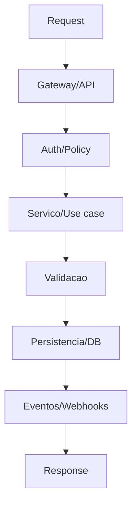

# Backend Flow (Mermaid)

Use este template para gerar o fluxo do backend. Substitua os blocos.

Checklist:
- Servicos e boundaries estao claros.
- Dependencias externas estao mapeadas.
- Politicas e validacoes aparecem.
- Eventos e filas estao documentados.
