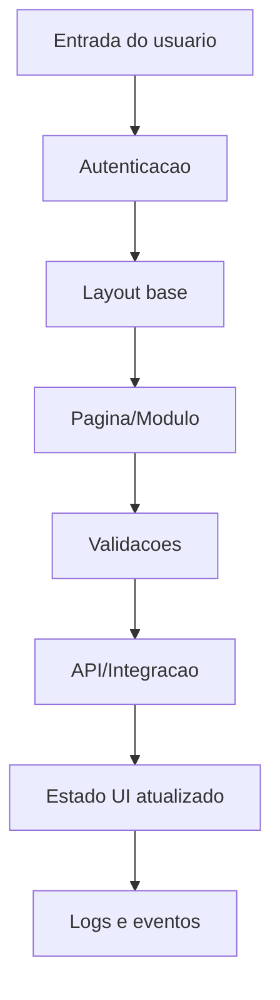

# Frontend Flow (Mermaid)

Use este template para gerar o fluxo do frontend. Substitua os blocos.

Checklist:
- Todas as paginas principais aparecem.
- Estados de erro e vazio aparecem.
- Pontos de integracao estao claros.
- Eventos e telemetria indicados.
